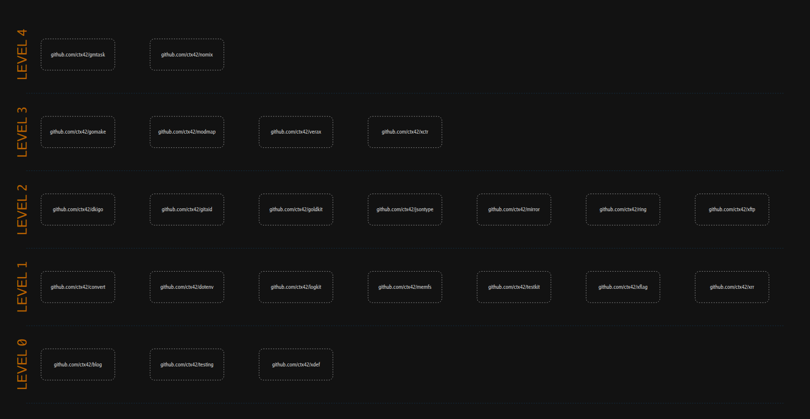
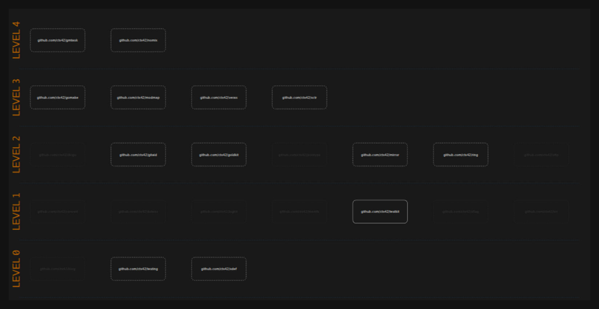

# modmap

Draw the modules of a Go workspace as an interactive map, so you can see
which module has to be updated next, and in what order.



## Overview

Change a module low in a dependency chain — a testing helper, an error
type — and the work does not stop there: every module that reaches it
has to be updated too, and only in an order that respects what depends
on what.

`modmap` answers that from the `go.mod` files themselves. It walks the
directories you name, follows each module's direct requirements, and
draws every module one level above the modules it requires. Level 0
holds the modules that depend on nothing, and each level above it is a
round of updates that cannot start before the level below is done.

The map is a single SVG file: no server, no build step, nothing to
install to look at it.

## Features

- Levels computed from the `go.mod` files, so the picture never drifts
  from the code.
- Hover a module to light the whole chain it sits on — what it relies
  on and what relies on it — and dim everything else.
- Click a module to pin that highlight; Tab reaches the modules from
  the keyboard.
- Module path globs decide what is drawn, applied while scanning, so an
  excluded module is never even fetched.
- Modules missing from disk are read from the Go module cache, and the
  network is touched only when the cache comes up short.
- Dependency cycles are reported with the path around them instead of
  being drawn as something they are not.
- One SVG file with the font embedded and the dependency data in
  `data-*` attributes; it carries no script at all.

## Prerequisites

- Go 1.26 or newer.

## Installation

> [!NOTE]
> The module is not published yet, so `go install` cannot reach it.
> Build from a checkout until it is.

From a checkout:

```shell
go build -o dist/modmap ./cmd/modmap
```

Once published:

```shell
go install github.com/ctx42/modmap/cmd/modmap@latest
```

## Usage

Map every ctx42 module found under a directory:

```shell
modmap --include 'github.com/ctx42/*' -o tmp/modules.svg ~/src/ctx42
```

Open `tmp/modules.svg` in a browser. Hover a module to light its chain,
click to pin it:



Here `github.com/ctx42/testkit` is pinned. Lit below it are the modules
it relies on, lit above it are the modules that have to be updated when
it changes, and everything unrelated is dimmed — `dkigo` among them,
which shares dependencies with `testkit` but does not use it.

`-o` is required: `modmap` never writes an SVG to a terminal.

### Filtering

Both options take a glob over the module path and may be repeated. A
module matching both lists is dropped, and `*` does not cross a `/`.

```shell
modmap --include 'github.com/ctx42/*' \
       --exclude 'github.com/ctx42/tst-*' \
       -o tmp/modules.svg ~/src/ctx42
```

Without `--include`, the map is the whole dependency closure —
third-party modules included. That is slower, because every `go.mod` in
the closure has to come from the cache or the network, and much wider.
`modmap` asks before rendering a level of more than 20 modules; `--yes`
answers for it in scripts.

### Several maps at once

A configuration file names the maps a project keeps, so they are
regenerated with one command:

```shell
modmap -c modmap.yaml
```

Naming maps generates only those: `modmap -c modmap.yaml ctx42 work`.
When a configuration file is used it is the only source of directories
and filters, so `--include`, `--exclude`, and `-o` cannot be combined
with `-c`. See [modmap.example.yaml](modmap.example.yaml), which
documents every key.

## Configuration

Command line options:

| Option          | Meaning                                          |
|-----------------|--------------------------------------------------|
| `-o, --out`     | SVG file to write; required without `-c`         |
| `-i, --include` | draw only modules matching the glob; repeatable  |
| `-e, --exclude` | never draw modules matching the glob; repeatable |
| `-c, --config`  | configuration file naming the maps to generate   |
| `-y, --yes`     | do not ask before rendering a very wide level    |
| `-h, --help`    | show usage                                       |

Configuration file keys, one entry per map under `maps`:

| Key       | Meaning                                              |
|-----------|------------------------------------------------------|
| `name`    | how the map is asked for; required and unique        |
| `dirs`    | directories to scan; at least one                    |
| `include` | globs deciding what is drawn; all modules when empty |
| `exclude` | globs removing modules; optional                     |
| `out`     | SVG file this map is written to; required            |

Relative paths in a configuration file resolve against the directory
holding the file, never against the working directory.

## How the map is built

- Every `go.mod` under the scanned directories is a module, nested ones
  included. The `.git`, `testdata`, and `vendor` directories are never
  descended into.
- Only direct requirements are followed; a `// indirect` line is not an
  edge. Each module reached is expanded in turn, so the closure builds
  itself.
- A module found on disk is read from disk. Any other module is read
  from the Go module cache, and its requirements are the union of every
  version the scan asked for — so a module path is one box however many
  versions of it are in play.
- A module's level is one above the highest level among the modules it
  requires, and the modules on a level are sorted by module path, so two
  runs over the same code produce the same file.

## Packages

The discovery and the graph are importable; the renderer and the command
line are not.

| Package                    | What it does                              |
|----------------------------|-------------------------------------------|
| [pkg/mod](pkg/mod)         | find modules, read and resolve `go.mod`   |
| [pkg/graph](pkg/graph)     | levels, cycle detection, dependent sets   |
